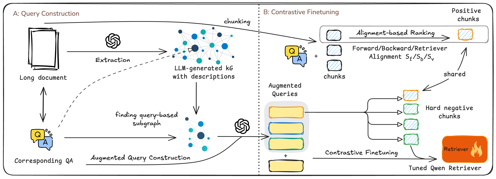
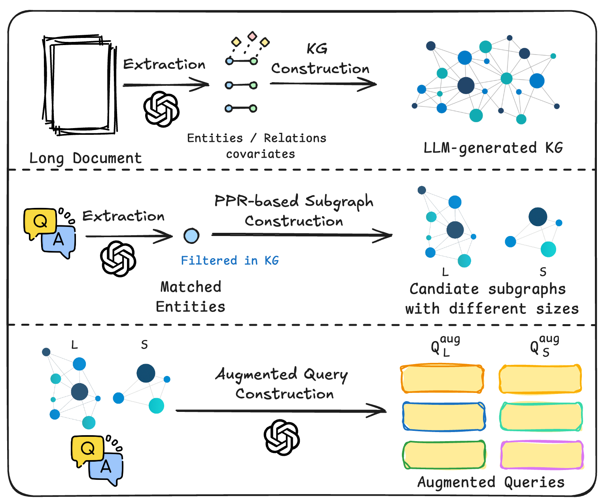
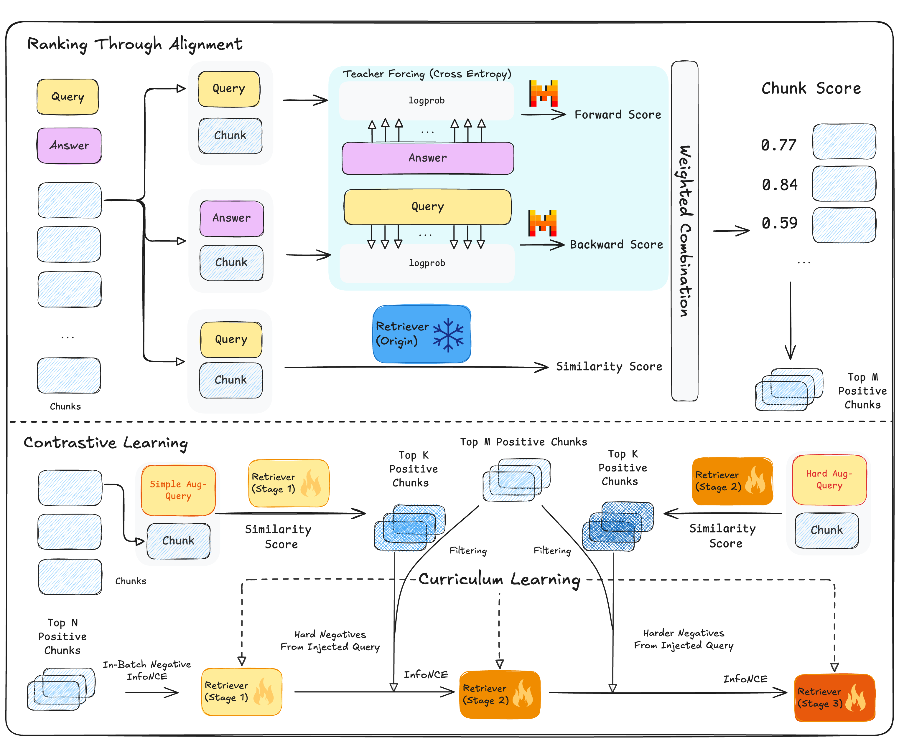

# ARK: Answer-Centric Retriever Tuning via  KG-augmented Curriculum Learning

<p align="center">
  <a href="https://www.python.org/downloads/"></a>
  <a href="LICENSE"></a>
  <a href="https://arxiv.org/abs/2511.16326"></a>
</p>

<p align="center">
  
  <br>
  <em>Figure 1: Overview of the ARK framework.</em>
</p>

## Overview

**Query Construction & Contrastive Finetuning**: ARK constructs a knowledge graph from documents, extracts query-based subgraphs, and generates augmented queries to mine hard negative chunks for contrastive learning.

<p align="center">
  
  <br>
  <em>Figure 2: Query augmentation via KG-driven subgraph extraction.</em>
</p>

**Answer-Centric Alignment & Curriculum Learning**: We rank chunks by forward/backward alignment scores (whether a chunk helps generate the correct answer), then progressively train the retriever from easy to hard negatives across three curriculum stages.

<p align="center">
  
  <br>
  <em>Figure 3: Answer-centric alignment and curriculum-based contrastive learning.</em>
</p>

## Quick Start

```bash
pip install -r requirements.txt
cp .env.example .env  # Setup API keys
```

## Pipeline

```bash
# 1. Knowledge Graph Construction
bash experiments/1-kg/generate_kg_{vllm,openai}.sh
bash experiments/1-kg/augment_kg.sh
bash experiments/1-kg/generate_comm.sh

# 2. Training Data Generation
bash experiments/2-training/generate_pos.sh
bash experiments/2-training/generate_query.sh
bash experiments/2-training/generate_neg.sh
bash experiments/2-training/generate_training.sh

# 3. Train
bash experiments/2-training/train_qwen_{single,multi}.sh

# 4. Evaluate
bash experiments/3-eval/base/*.sh
bash experiments/3-eval/finetuned/run_qwen.sh

# 5. Stats
bash experiments/4-stats/kg.sh
bash experiments/4-stats/coverage.sh
```

## Config

Configuration files in `src/config/`:
- `alignment.yaml` - Alignment score computation, subgraph extraction, query_generation, training samples
- `kg.yaml` - Knowledge graph construction
- `llm.yaml` - LLM API and inference settings
- `retrieval_model.yaml` - Retrieval model settings
- `training.yaml` - Training params

## Results

All experiments use Mistral-7B v0.2 as the reader and Qwen3-Embedding-0.6B as the default ARK retriever. 
For fair comparison, all methods retrieve Top-5 chunks (chunk size = 512, overlap = 12).

**LongBench (F1 Score):**

| Model | NarrativeQA | Qasper | MuSiQue | 2WikiMQA | HotpotQA |
|-------|-------------|--------|---------|----------|----------|
| Qwen3-embedding | 19.58 | 23.90 | 14.19 | 21.24 | 35.27 |
| BGE-M3 | 18.37 | 23.33 | 21.13 | 22.86 | 38.64 |
| Stella-v5 | 20.90 | 23.39 | 17.08 | 22.13 | 35.45 |
| HippoRAG | 11.51 | 21.90 | 13.09 | 30.96 | 28.71 |
| **ARK (Ours)** | **21.57** | **24.04** | **20.60** | **23.41** | **42.35** |

**UltraDomain (F1 Score):**

| Model | Biology | Fiction | Music | Technology | Philosophy |
|-------|---------|---------|-------|------------|------------|
| Qwen3-embedding | 32.99 | 29.41 | 34.90 | 38.03 | 34.04 |
| BGE-M3 | 32.52 | 31.72 | 35.34 | 39.13 | 35.97 |
| Stella-v5 | 33.85 | 32.41 | 35.02 | 35.16 | 34.09 |
| HippoRAG | 36.13 | 29.23 | 32.94 | 27.15 | 29.06 |
| **ARK (Ours)** | **36.19** | **32.59** | **38.03** | **40.16** | **37.86** |


## Acknowledgments

**Models** (Base retriever and training framework):
- [Qwen3-Embedding-0.6B](https://huggingface.co/Qwen/Qwen3-Embedding-0.6B)
- [MS-SWIFT](https://github.com/modelscope/ms-swift)
- LLM Providers: Gemini, DeepSeek, GPT

**Datasets** (Evaluation benchmarks):
- [LongBench](https://github.com/THUDM/LongBench)
- [UltraDomain](https://huggingface.co/datasets/MemoRAG/UltraDomain)

**Baselines** (Comparison methods):
- [HippoRAG](https://github.com/OSU-NLP-Group/HippoRAG)
- [LightRAG](https://github.com/HKUDS/LightRAG)
- [MemoRAG](https://github.com/qhjqhj00/MemoRAG)
- [GraphRAG](https://github.com/microsoft/graphrag)
- [Nano-GraphRAG](https://github.com/gusye1234/nano-graphrag)


## Citation

```bibtex
@article{zhou2025ark,
  title={ARK: Answer-Centric Retriever Tuning via KG-augmented Curriculum Learning},
  author={Zhou, Jiawei and Ding, Hang and Jiang, Haiyun},
  journal={arXiv preprint arXiv:2511.16326},
  year={2025}
}

@misc{zhou2025ark_repo,
  author={Zhou, Jiawei and Ding, Hang},
  title={Code Repo for ARK: Answer-Centric Retriever Tuning via KG-augmented Curriculum Learning},
  year={2025},
  url={https://github.com/valleysprings/ARK},
}
```

## License

MIT License
